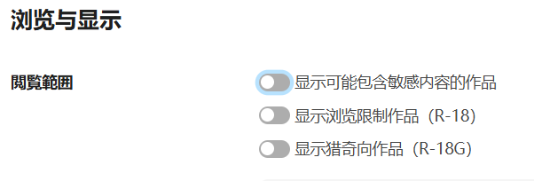
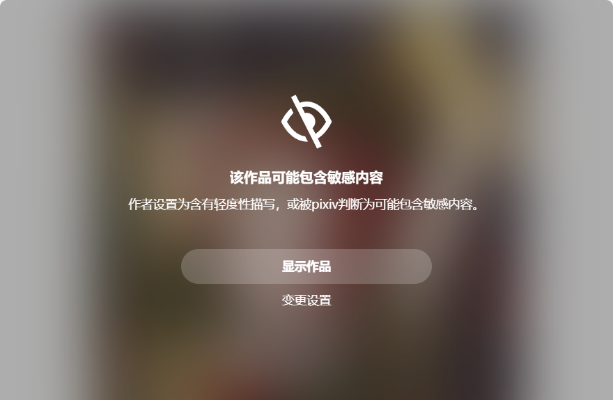

在图像作品的数据中有 `sl` 字段，现在测试了一番。（小说数据里没有这个字段）

`
sl: 0 | 2 | 4 | 6
`

-----------

测试过程：

在 [综合今日排行榜](https://www.pixiv.net/ranking.php?mode=daily) 的**一般**分类中，抓取所有作品，`2`、`4`、`6` 皆有。

在 [综合R-18每日排行榜](https://www.pixiv.net/ranking.php?mode=daily_r18) 中，抓取所有作品，`sl` 皆为 `6`。

在 [综合R-18G排行榜](https://www.pixiv.net/ranking.php?mode=r18g) 中，抓取所有作品，`sl` 皆为 `6`。

经过群友推测，可能是“sexy level”，即“色情等级”。经过验证似乎还有那么几分道理……

例如：

- sl 为 0 的是新发布的普通作品，可能是未进行此项测定。在发布后经过一段时间后，0 会变成其他数值。
- sl 为 2 的基本都没什么色情元素；
- sl 为 4 的大部分都有明显的色情元素，比如巨乳、大白腿、衣服裸露程度较高
- sl 为 6 的大部分都有强烈的色情元素，不仅裸露程度更高，而且也有很多擦边球，例如露出了乳晕，或者关键部位若隐若现等。

注意：sl 为 6 的作品不一定是 R-18，只是有可能是 R-18。

-----------

浏览设置里的“敏感内容”指的是从 sl 为 4 或 6 的全年龄作品。

在 pixiv 的用户设置里：
https://www.pixiv.net/settings/viewing

如果没有启用第一项“显示可能包含敏感内容的作品”，那么 sl ≥ 4 的作品就不会显示。例如这个作品的 sl 是 4：

https://www.pixiv.net/artworks/124573140

在作品页面里会这样：

而在用户主页的作品列表页面里，它是完全不会显示的，在返回的 API 里也没有它的数据，因为它是从服务器端被过滤掉了。此时，让下载器在列表页抓取的话，也抓取不到这些被隐藏的作品。这是正常的，要抓取的话就需要用户设置为显示这些作品。

PS：第一个开关“显示可能包含敏感内容的作品”只是针对全年龄作品生效的。如果只启用它，就只是会显示全年龄里 sl 为 4 或 6 的作品，但不会显示 R-18（G） 作品。要显示 R-18（G） 作品作品，必须启用第二、第三个针对性的开关。
